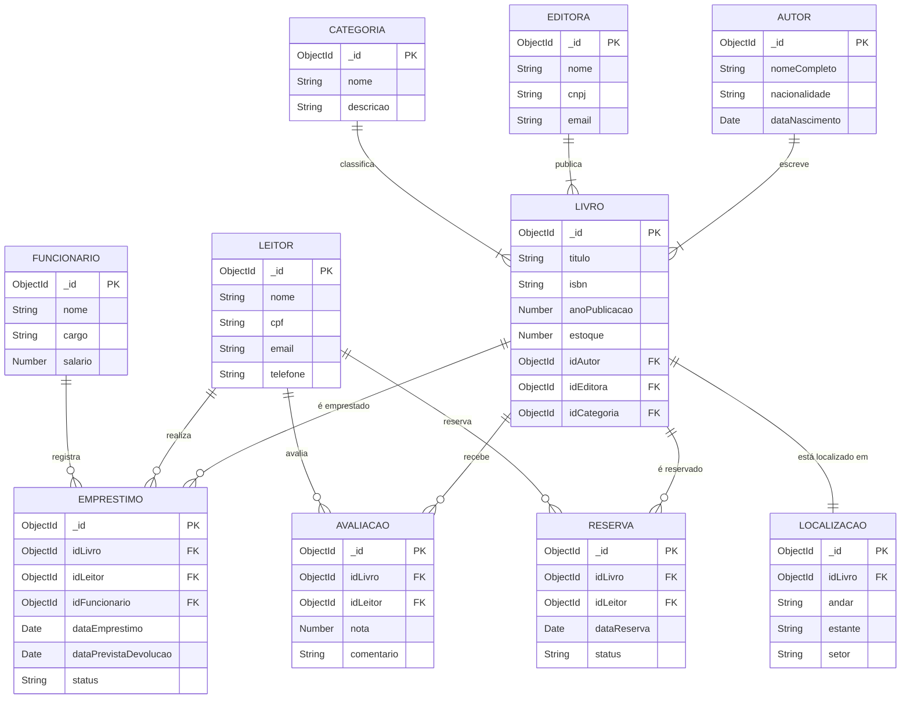

# Trabalho A2 - Construção de Backend: API de Gerenciamento de Biblioteca Digital

## 📖 Descrição

Este projeto consiste no desenvolvimento de uma API RESTful completa para o gerenciamento de uma Biblioteca Digital. O sistema foi construído seguindo a arquitetura MVC, utilizando Node.js e MongoDB, e abrange o controle de acervo (livros, autores, editoras), usuários (leitores, funcionários) e operações transacionais (empréstimos, reservas, avaliações).

O objetivo principal é consolidar os conhecimentos sobre construção de backend, operações CRUD, relacionamentos entre coleções no banco de dados NoSQL (MongoDB), validação de dados robusta e documentação técnica.

Este trabalho foi desenvolvido para a disciplina de **Construção de Backend**.

## 🛠️ Tecnologias Utilizadas

O projeto foi desenvolvido utilizando as seguintes tecnologias e bibliotecas:

- **Node.js** (Ambiente de execução)
- **Express** (Framework web)
- **Mongoose** (ODM para MongoDB)
- **Dotenv** (Gerenciamento de variáveis de ambiente)
- **Yup** (Validação de esquemas e dados)
- **Bcryptjs** (Criptografia de dados sensíveis)
- **Nodemon** (Monitoramento do servidor em desenvolvimento)

## 🗂️ Modelagem de Dados

Abaixo está o diagrama de entidade-relacionamento (DER) representando as coleções do MongoDB e suas conexões.



### Descrição das Collections e Relacionamentos

O banco de dados é composto por 10 entidades interligadas:

1.  **Livro (Central):** Conecta-se obrigatoriamente a _Autor_, _Editora_ e _Categoria_.
2.  **Autor, Editora, Categoria:** Entidades de cadastro base para compor o livro.
3.  **Leitor:** Usuário final que interage com o acervo.
4.  **Funcionário:** Responsável por registrar operações administrativas.
5.  **Empréstimo:** Relaciona _Livro_, _Leitor_ e _Funcionário_. Controla datas de devolução.
6.  **Avaliação:** Permite que o _Leitor_ avalie um _Livro_.
7.  **Reserva:** Permite que o _Leitor_ reserve um _Livro_ indisponível.
8.  **Localização:** Define o endereço físico (estante/corredor) de um _Livro_.

## 🚀 Como Rodar o Projeto

Para executar este projeto localmente, siga os passos abaixo:

1.  **Clone o repositório:**

    ```bash
    git clone https://github.com/Lucas537/API-Bliblioteca-Virtual.git
    ```

2.  **Navegue até o diretório do projeto:**

    ```bash
    cd api-biblioteca
    ```

3.  **Instale as dependências:**

    ```bash
    npm install
    ```

4.  **Configure as Variáveis de Ambiente:**
    Crie um arquivo `.env` na raiz do projeto baseando-se no `.env.example` e insira sua string de conexão do MongoDB Atlas:

    ```env
    DB_USER=seu_usuario
    DB_PASS=sua_senha
    DB_HOST=cluster.mongodb.net
    DB_NAME=biblioteca_db
    PORT=3000
    ```

5.  **Inicie o servidor:**

    ```bash
    npm start
    ```

    Após a execução, o servidor estará rodando em `http://localhost:3000/api`.

## 🔌 Endpoints da API

A API possui 10 recursos principais. Todos aceitam os métodos `GET`, `POST`, `PUT` e `DELETE`.

| Recurso          | Rota Base           | Descrição                   | Exemplo de Body (JSON)                                |
| :--------------- | :------------------ | :-------------------------- | :---------------------------------------------------- |
| **Livros**       | `/api/livros`       | Gerencia o acervo de livros | `{"titulo": "Dom Casmurro", "idAutor": "..."}`        |
| **Autores**      | `/api/autores`      | Cadastro de autores         | `{"nomeCompleto": "Machado de Assis"}`                |
| **Editoras**     | `/api/editoras`     | Cadastro de editoras        | `{"nome": "Penguin", "email": "contato@penguin.com"}` |
| **Leitores**     | `/api/leitores`     | Usuários da biblioteca      | `{"nome": "João", "cpf": "123.456.789-00"}`           |
| **Categorias**   | `/api/categorias`   | Gêneros literários          | `{"nome": "Romance"}`                                 |
| **Funcionários** | `/api/funcionarios` | Staff da biblioteca         | `{"nome": "Ana", "cargo": "Bibliotecária"}`           |
| **Empréstimos**  | `/api/emprestimos`  | Registro de saídas          | `{"idLivro": "...", "idLeitor": "..."}`               |
| **Avaliações**   | `/api/avaliacoes`   | Feedback dos leitores       | `{"nota": 5, "comentario": "Ótimo!"}`                 |
| **Reservas**     | `/api/reservas`     | Fila de espera              | `{"idLivro": "...", "status": "Pendente"}`            |
| **Localizações** | `/api/localizacoes` | Endereço físico do livro    | `{"corredor": "A", "estante": "B3"}`                  |

📄 **Documentação Completa:**
Para testar todas as rotas, importe o arquivo JSON no Postman:
➡️ **[docs/postman_collection.json](docs/postman_collection.json)**

## 👥 Alunos e Contribuições

Abaixo estão detalhadas as responsabilidades e contribuições de cada membro do grupo para a entrega deste projeto.

| Aluno(a)                                | GitHub                                                | Contribuições Detalhadas                                                                                                                                                                                                                                                                                              |
| :-------------------------------------- | :---------------------------------------------------- | :-------------------------------------------------------------------------------------------------------------------------------------------------------------------------------------------------------------------------------------------------------------------------------------------------------------------- |
| **Lucas Lopes de Araújo**               | [Lucas537](https://github.com/Lucas537)               | **CRUDs:** _Livros_, _Autores_, _Categorias_.<br>**Funcionalidades:** Configuração inicial do projeto (Server, Database connection), Estrutura de pastas MVC, Lógica de relacionamento central do Livro.<br>**Issues:** \#1 (Setup), \#2 (Modelagem Livro), \#3 (CRUD Autor/Categoria).                               |
| **Victor Henrique de Oliveira Barboza** | [Victorbarboza07](https://github.com/Victorbarboza07) | **CRUDs:** _Leitores_, _Empréstimos_, _Reservas_.<br>**Funcionalidades:** Lógica de datas para empréstimos e devoluções, Validação de CPF e Telefone com Regex, Regras de negócio para reserva.<br>**Issues:** \#4 (Validação Yup Leitor), \#5 (Lógica de Empréstimo), \#6 (Status Reserva).                          |
| **Lorran Lucas de Almeida**             | _(Adicionar Link)_                                    | **CRUDs:** _Funcionários_, _Localizações_.<br>**Funcionalidades:** Implementação de `bcryptjs` para segurança de dados sensíveis, Middleware de tratamento de erros (`errorHandler`), Validação de unicidade de localização.<br>**Issues:** \#7 (Middleware Erros), \#8 (CRUD Funcionário), \#9 (Localização Física). |
| **Igor Marques**                        | [igormarques16](https://github.com/igormarques16)     | **CRUDs:** _Editoras_, _Avaliações_.<br>**Funcionalidades:** Documentação técnica no Postman, Middleware de validação genérica (`validate.js`), Validação de notas (1-5) nas avaliações.<br>**Issues:** \#10 (Collection Postman), \#11 (Validação Genérica), \#12 (CRUD Editora/Avaliação).                          |

---

**Curso:** Análise e Desenvolvimento de Sistemas
**Disciplina:** Construção de Backend
